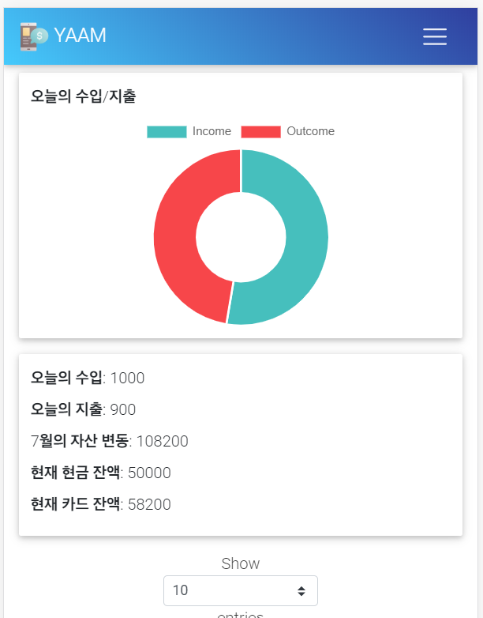
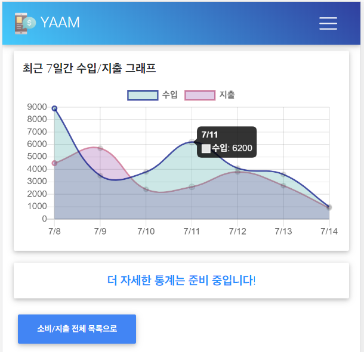

# YAAM
**YAAM** 은 Node.js와 npm을 사용하여 만든 <u>예산 관리자 웹 애플리케이션</u>입니다.


<br />

<br />


+ 유저 정보와, 관리 내역들은 MongoDB와 연계하여 사용하였습니다.
+ 기본 UI는 [BootStrap](https://mdbootstrap.com/)에서 사용하였습니다.

***
Copyright (C) 2020 Jihoon Kim<br />
**LICENSED as** ```GPL-3.0```
